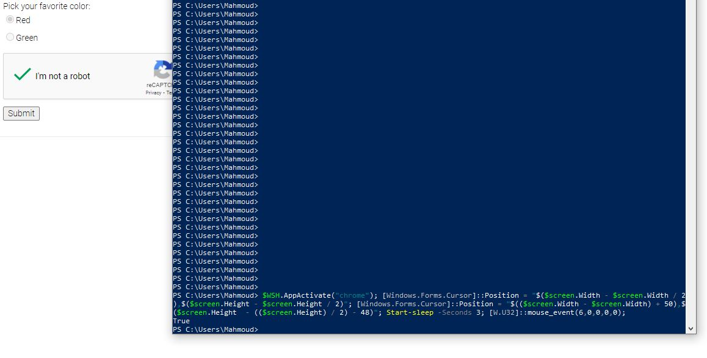

# powershell_scrape

https://learn.microsoft.com/en-us/dotnet/api/microsoft.visualbasic.devices.keyboard.sendkeys?view=windowsdesktop-8.0
#
$WSH.AppActivate uses the app title usally what seen in app if you need get title of opened window 

```Get-Process | % {$_.MainModule} | ft Product,Description```

Anti Normal I'm not robot captcha.



#### db work
for save data in file you can open existing file using notepade
```ps
Start-Process 'C:\Users\Mahmoud\Desktop\facebook_users.txt'
```

or using notepadd ++ , first is path of app which is notepad++ and second is file name
```ps
Start-Process 'C:\Program Files (x86)\Notepad++\notepad++.exe' 'C:\Users\Mahmoud\Desktop\facebook_users\users.txt'
```

```python
convert image to binary
img = cv2.imread('ff.jpg', 2)
  
ret, bw_img = cv2.threshold(img, 127, 255, cv2.THRESH_BINARY)
  
# converting to its binary form
bw = cv2.threshold(img, 127, 255, cv2.THRESH_BINARY)
  
cv2.imshow("Binary", bw_img)
cv2.waitKey(0)
cv2.destroyAllWindows()
```

script open console
https://www.codecademy.com/article/running-javascript-in-the-browser-console

```powershell

$youtube = [PSCustomObject] @{
  SearchInput = "450,115";
  Clear = "^a{BS}";
};

function search(){
     param([string] $term)
     $WSH.AppActivate("chrome"); start-sleep -S 1;[Windows.Forms.Cursor]::Position =$youtube.SearchInput;Start-sleep -Seconds 1; [W.U32]::mouse_event(6,0,0,0,0);$WSH.sendKeys("^a");start-sleep -Miliseconds 100;$WSH.sendKeys("{BS}");Start-sleep -S 1;$WSH.sendKeys($term);$WSH.sendKeys("~");
}

```


### short cut to focus console
1. ctrl + alt + j = > open console
2. f6 => 5click go in console without focus
3. uparrow => 5 times force console to display the mouse
4. your-code-can-writen-fine
